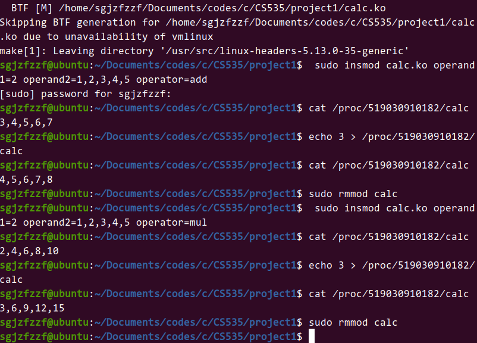
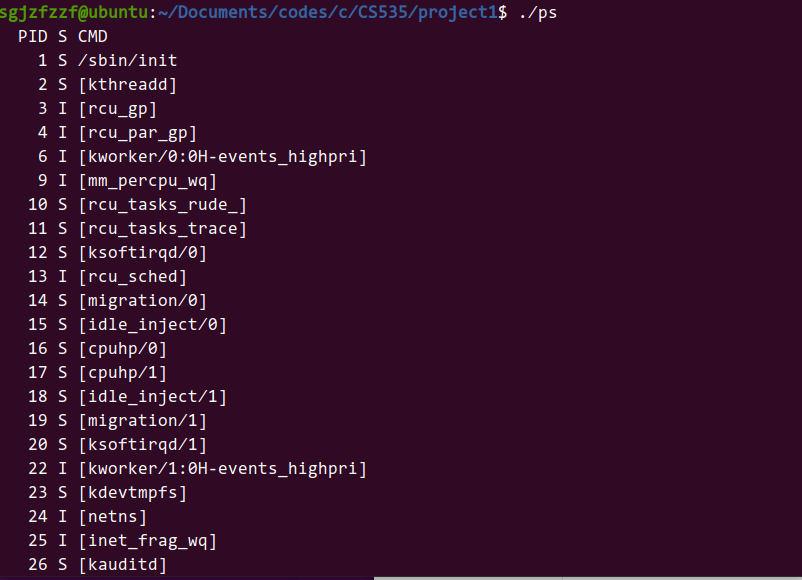

# 实验一实验报告

## 实验目的

1. 编写一个内核模块，通过 proc 文件系统与用户交互，实现一个简单的计算器。
2. 编写一个程序，通过 proc 文件系统提供的信息来实现一个简单版本的 ps 程序。

## 实验过程

### 准备

打开Ubuntu虚拟机，创建实验文件夹。执行如下指令

```bash
git pull git@github.com:chengjiagan/CS353-2022-Spring.git
```

在本地创建实验环境。

### 模块一

在本模块的实现中我认为主要的难点在于module编程的范式。由于以前缺少相关类型编程的经验，因此在开始实验之前我花费了一定的时间仔细地阅读了老师课堂上给出的示例和网络上搜索到的相关资料。在完成学习后我感觉module的编程类似事件驱动编程的模型，分别为模块注册诸如proc_write，proc_read，proc_init，proc_exit等“回调函数”以进行模块的正常工作。在完成这一部分的工作后理清module的工作模式，处理好字符串的输入输出并进行debug，该模块的编程便顺利完成。代码如下

```c
#include <linux/kernel.h>
#include <linux/module.h>
#include <linux/proc_fs.h>
#include <linux/uaccess.h>

#define MAX_SIZE 128
#define ID "519030910182"

static int operand1;
module_param(operand1, int, 0);
static char *operator;
module_param(operator, charp, 0);
static int operand2[MAX_SIZE];
static int ninp;
module_param_array(operand2, int, &ninp, 0);

static struct proc_dir_entry *proc_ent;
static struct proc_dir_entry *proc_dir;
static char output[MAX_SIZE];
int out_len;

static ssize_t proc_read(struct file *fp, char __user *ubuf, size_t len, loff_t *pos)
{
    int tmp[MAX_SIZE], p = 0, i, j, num;
    char buf[MAX_SIZE];
    memset((void *)output, 0, sizeof(output));
    if (*pos > 0)
    {
        return 0;
    }
    if (len < MAX_SIZE)
    {
        return -EFAULT;
    }
    if (strcmp(operator, "add") == 0)
    {
        for (i = 0; i < ninp; ++i)
        {
            tmp[i] = operand1 + operand2[i];
        }
    }
    else if (strcmp(operator, "mul") == 0)
    {
        for (i = 0; i < ninp; ++i)
        {
            tmp[i] = operand1 * operand2[i];
        }
    }
    for (i = 0; i < ninp; ++i)
    {
        for (num = tmp[i]; num > 0; num /= 10, ++p)
        {
            memset((void *)buf, 0, sizeof(buf));
            for (j = 0; num > 0; num /= 10, ++j)
            {
                buf[j] = num % 10 + '0';
            }
            for (--j; j >= 0; --j)
            {
                output[p++] = buf[j];
            }
        }
        output[p++] = ',';
    }
    output[--p] = '\n';
    ++p;
    output[p++] = '\0';
    if (copy_to_user((void *)ubuf, (void *)output, p))
    {
        return -EFAULT;
    }
    *pos = p;
    return p;
}

static ssize_t proc_write(struct file *fp, const char __user *ubuf, size_t len, loff_t *pos)
{
    int num = 0, i;
    memset((void *)output, 0, sizeof(output));
    if (*pos > 0 || len > MAX_SIZE || copy_from_user(output, ubuf, len))
    {
        return -EFAULT;
    }
    for (i = 0; i < len - 1; ++i)
    {
        num *= 10;
        num += (output[i] - '0');
    }
    operand1 = num;
    return len;
}

static const struct proc_ops proc_ops = {
    .proc_read = proc_read,
    .proc_write = proc_write,
};

static int __init proc_init(void)
{
    proc_dir = proc_mkdir(ID, NULL);
    proc_ent = proc_create("calc", 0666, proc_dir, &proc_ops);
    if (proc_dir && proc_ent)
    {
        return 0;
    }
    else
    {
        proc_remove(proc_ent);
        return -ENOMEM;
    }
}

static void __exit proc_exit(void)
{
    proc_remove(proc_dir);
    proc_remove(proc_ent);
}

module_init(proc_init);
module_exit(proc_exit);
MODULE_LICENSE("GPL");
```

### 模块二

在本模块的编写中，我遇到最为棘手的问题在于两方面。

首先是Linux系统中文件系统相关函数的调用。在开始本模块的编写之前我先搜索了相关的资料，了解学习了dirent.h库，学会了如何利用C语言对文件系统进行访问。其次是读取相关文件后的解析和合理地输出结果。比如读取stat文件后为了获取需要的信息需要先对直接读取的字符串进行处理以实现对有效信息的提取，又如如何保证程序的输出能够符合规范。一件值得一提的小事是读取comm文件后的内容会在末尾附带一个'\n'字符，导致整体的输出格式被破坏，需要通过预先的处理保证正确的输出，但是在读取其他文件时没有出现这样的情况。代码如下

```c
#include <stdio.h>
#include <dirent.h>
#include <ctype.h>
#include <string.h>
#include <unistd.h>
#include <fcntl.h>

#define PATHBUFFERSIZE 0x100
#define STRBUFFERSIZE 0x10000

int isValidPid(char *pid)
{
    for (int i = 0; pid[i] != '\0'; ++i)
    {
        if (pid[i] < '0' || pid[i] > '9')
        {
            return 0;
        }
    }
    return 1;
}

char getS(char *stat)
{
    int spaceCount = 0, i = 0;
    for (; spaceCount < 2; ++i)
    {
        if (stat[i] == ' ')
        {
            ++spaceCount;
        }
    }
    return stat[i];
}

int main(int argc, char *argv[])
{
    char pathbuf[PATHBUFFERSIZE] = "/proc", strbuf[STRBUFFERSIZE];
    int index1 = strlen(pathbuf);
    DIR *dir = opendir(pathbuf);
    struct dirent *dirent;
    if (dir == NULL)
    {
        fprintf(stderr, "cannot open proc\n");
        return -1;
    }
    printf("  PID S CMD\n");
    while ((dirent = readdir(dir)))
    {
        if (dirent->d_type == 4 && isValidPid(dirent->d_name))
        {
            pathbuf[index1] = '/';
            strcpy(pathbuf + index1 + 1, dirent->d_name);
            int index2 = strlen(pathbuf), pidlen = strlen(dirent->d_name);
            DIR *subdir = opendir(pathbuf);
            if (pidlen < 5 && subdir != NULL)
            {
                pathbuf[index2] = '/';
                for (int i = 0; i < 5 - pidlen; ++i)
                {
                    printf(" ");
                }
                printf("%s", dirent->d_name);
                strcpy(pathbuf + index2 + 1, "stat");
                memset((void *)strbuf, 0, sizeof(strbuf));
                int fd = open(pathbuf, O_RDONLY);
                if (fd > 0)
                {
                    if (read(fd, strbuf, STRBUFFERSIZE) != STRBUFFERSIZE)
                    {
                        printf(" %c ", getS(strbuf));
                    }
                }
                close(fd);
                memset((void *)strbuf, 0, sizeof(strbuf));
                int flag = 0;
                strcpy(pathbuf + index2 + 1, "cmdline");
                if ((fd = open(pathbuf, O_RDONLY)) >= 0)
                {
                    int len = read(fd, strbuf, STRBUFFERSIZE);
                    if (len != 0 && len != STRBUFFERSIZE)
                    {
                        printf("%s", strbuf);
                        flag = 1;
                    }
                    close(fd);
                }
                strcpy(pathbuf + index2 + 1, "comm");
                memset((void *)strbuf, 0, sizeof(strbuf));
                if (!flag && (fd = open(pathbuf, O_RDONLY)) >= 0)
                {
                    if (read(fd, strbuf, STRBUFFERSIZE) != STRBUFFERSIZE)
                    {
                        strbuf[strlen(strbuf) - 1] = '\0';
                        printf("[%s]", strbuf);
                    }
                    close(fd);
                }
                printf("\n");
            }
            closedir(subdir);
        }
    }
    closedir(dir);
    return 0;
}
```

## 实验结果

实验结果截图如下





## 实验心得

本次实验我花费时间最多的地方在于实验环境的配置。由于我习惯使用Visual Studio Code进行程序编写，因此本次实验我也同样进行了选择。但是在下载好代码后我发现代码编辑器对于某些头文件无法正确的进行搜索。尽管Makefile文件在初步完成后可以正常进行编译，但是缺少代码提示和满屏错误提示的情况仍然让我十分难受。因此我花费了很多时间在解决这个问题上。查阅相关资料后我发现这是因为配置文件中includePath一项没有包含部分头文件的路径，同时defines一项也缺少必要的内容，这导致了代码编辑器无法正常获取所需的信息以辅助代码的编写。在资料的帮助下我重新配置了json文件并解决了问题。我认为对于初次接触内核编程的编程者讲解一下这些可能出现的问题及解决方案是有必要的。