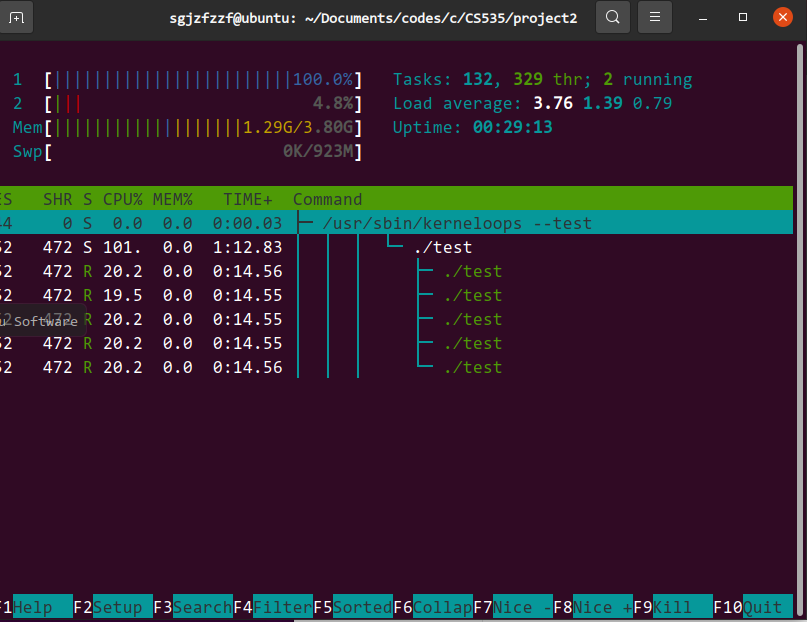
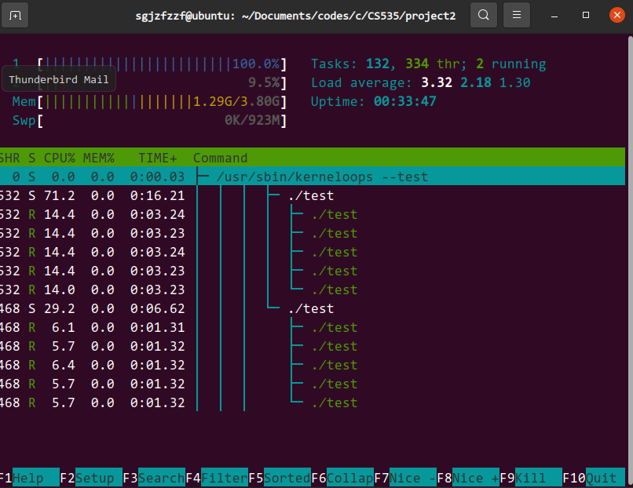
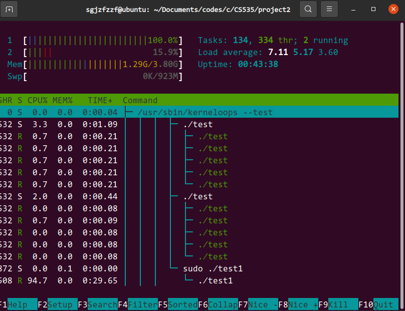

# 实验二实验报告

## 实验一

### 实验目的

创建十个CPU-bound程序，并将他们绑定在同一个CPU核心上，修改这些进程(线程)的优先级使得 其中5个进程占用大约70%的CPU资源，另外5个进程使用剩下的30%。在同一组中的进程应该具有相同的优先级，使用top或htop命令验证实验结果。

### 实验环境

Windows11操作系统上运行Ubuntu20.04版本的Linux操作系统虚拟机作为实验环境，该虚拟机共有两颗虚拟CPU。

### 实验步骤

编写代码文件`test.c`，编译生成用于测试的可执行文件`test`

```c
#include <unistd.h>
#include <stdio.h>

#define __USE_GNU
#include <sched.h>
#include <pthread.h>

void *func(void *arg)
{
    for (;;)
        ;
}

int main()
{
    cpu_set_t set;
    CPU_ZERO(&set);
    CPU_SET(0, &set);
    if (sched_setaffinity(0, sizeof(set), &set) == -1)
    {
        return -1;
    }
    pthread_t threads[5];
    for (int i = 0; i < 5; ++i)
    {
        pthread_create(&threads[i], NULL, &func, NULL);
    }
    for (int i = 0; i < 5; ++i)
    {
        pthread_join(threads[i], NULL);
    }
    return 0;
}
```

首先将目标程序绑定在0号CPU上，避免操作系统将该程序调度到其他CPU上执行造成实验效果的破坏。接着通过`pthread`库创建5个进程，并在进程中执行死循环来保证进程的运行。

输入指令

```bash
gcc -o test test.c -lpthread
```

编译生成目标可执行文件。

编写代码文件`test1.c`，编译生成用于测试的可执行文件`test1`

```c
#include <unistd.h>
#include <stdio.h>

#define __USE_GNU
#include <sched.h>
#include <pthread.h>

int main()
{
    cpu_set_t set;
    CPU_ZERO(&set);
    CPU_SET(0, &set);
    if (sched_setaffinity(0, sizeof(set), &set) == -1)
    {
        return -1;
    }
    pid_t pid = getpid();
    struct sched_param param;
    param.sched_priority = 1;
    sched_setscheduler(pid, SCHED_RR, &param);
    for (;;)
        ;
    return 0;
}
```

首先将目标程序绑定在0号CPU上，避免操作系统将该程序调度到其他CPU上执行造成实验效果的破坏。接着对通过利用`pid`设置进程调度策略，设置优先级为1，将其设置为时间片轮转算法以成为实时进程并进入死循环。

输入指令

```bash
gcc -o test1 test1.c -lpthread
```

编译生成目标可执行文件。注意的是此程序需要在超级用户权限下进行执行

首先执行

```c
nice -7 ./test &
```

在后台创建一个`nice`值为7的`test`程序运行，此时运行`htop`查看程序运行情况



此时程序的CPU时间占用几乎达到100%。

杀死程序，重新执行指令

```bash
nice -7 ./test & nice -3 ./test & 
```

后台创建两个`test`程序进行执行，其中一个`nice`值为7，另一个为3，从而实现对CPU运行时间7：3的分配。

打开htop观察



可见，两个`test`程序分别占据CPU时间的71.2%和29.2%，大概实现了7：3的时间分配。同时各个程序内部的线程执行时间大致占比平分相等。

接着通过指令

```bash
sudo ./test1 & nice -7 ./test & nice -3 ./test & 
```

在后台创建实时进程`test1`并执行，打开`htop`观察结果如下



可以看到`test1`程序占据了几乎全部的CPU时间，共计94.7%，可见实时进程成功进行了抢占。

## 实验二

### 实验目的

修改Linux源代码，为每个进程添加调度次数的记录。

### 实验环境

为了避免对内核可能的修改导致本地环境的破坏，所以这一实验我选择在云主机上进行，操作系统为Linux发行版Ubuntu20.04，共计4个虚拟CPU，8GB内存。

打开路径`/usr/src`，可以观察到有代码文件夹`linux-5.4.113`，接下来将以此版本的源代码为基础进行修改。

### 实验步骤

进入代码文件夹，进行代码阅读。首先按照提示找在`include/linux/sched.h`文件中`task_struct`数据结构，在其中添加对应的数据结构`int ctx`，用于记录进程的调度次数。

```c
struct task_struct {
    // ...
    int ctx; // counter
	int on_rq;

	int prio;
    // ...
};
```

接着对`ctx`进行初始化。根据页面[^1]的介绍，可以得知新进程的创建主要依赖于系统调用`sys_clone`，一层层追溯到`kernel/fork.c`的`_do_fork`函数中，找到`copy_process`函数的位置。这个函数主要对父进程的各种资源进行复制并创建一个新的进程描述符，于是我们对新的进程描述符进行修改，在其后添加`p->ctx = 0;`对新进程的`ctx`成员进行初始化。

```c
long _do_fork(struct kernel_clone_args *args)
{
    // ...
    
    p = copy_process(NULL, trace, NUMA_NO_NODE, args);
	p->ctx = 0; // initialize the ctx
	add_latent_entropy();
    
    // ...
}
```

接着进行`ctx`的维护。根据页面[^2]的介绍，调度的接口在`schedule`函数，我们在`kernel/sched/core.c`文件中找到了这个函数。在这个函数中首先获取了当前运行程序的`task_struct`结构，接着关闭抢占允许并持续对进程进行调度直至调度完成。于是在获取`tsk`对象后我们即可以对其的`ctx`进行增加表示其进行了相关的调度。

```c
asmlinkage __visible void __sched schedule(void)
{
	struct task_struct *tsk = current;
    ++tsk->ctx;

	sched_submit_work(tsk);
	do {
		preempt_disable();
		__schedule(false);
		sched_preempt_enable_no_resched();
	} while (need_resched());
	sched_update_worker(tsk);
}
EXPORT_SYMBOL(schedule);
```

最后是在`/proc/<PID>`文件夹下为`ctx`对象创建对应的可读文件。打开文件` fs/proc/base.c`，找对数组`tgid_base_stuff`，可以看到`/proc/<PID>`文件夹下对应的子文件夹和文件在此处进行注册，各种宏中由`ONE`进行可读文件的创建。因此在数组中我们添加对应的对象并为它注册相应的函数。

```c
static const struct pid_entry tgid_base_stuff[] = {
    // ...
    ONE("ctx", S_IRUSR, proc_pid_ctx),
    // ...
};
```

接下来模仿`proc_pid_limits`函数定义`proc_pid_ctx`函数，以实现读`ctx`文件的正常返回。

```c
// read ctx from this file
static int proc_pid_ctx(struct seq_file *m, struct pid_namespace *ns,
			struct pid *pid, struct task_struct *task)
{
	int err = lock_trace(task);
	if (!err) {
		seq_printf(m, "%d\n", task->ctx);
		unlock_trace(task);
	}
	return err;
}
```

修改好文件后，我们在源代码目录下执行如下指令

```bash
make menuconfig
make -j8
make modules_install
make install
reboot
```

对内核进行重新编译并重启。在重启界面敲击Shift键进入grub界面，选择对应版本的内核进行启动。操作系统启动后利用指令`uname -r`进行检查，判断启动的内核是否正确。

在测试方面，我们创建了`test.c`文件如下

```c
#include <stdio.h>

int main()
{
    while (1)
    {
        getchar();
    }
    return 0;
}
```

利用`gcc`对该文件进行编译，得到`test`可执行文件。

运行`test`程序，利用`ps`指令获取`pid`，结果如下

```bash
root@linuxkernel:/home/codes/c/LinuxLabs/lab2# ps -al
F S   UID     PID    PPID  C PRI  NI ADDR SZ WCHAN  TTY          TIME CMD
4 S     0    6349     705  0  80   0 -  2543 poll_s tty1     00:00:00 bash
0 S     0   12672   12652  0  80   0 -   622 wait_w pts/0    00:00:00 test
4 R     0   12706   12683  0  80   0 -  2633 -      pts/1    00:00:00 ps
```

输入指令获取对应的`ctx`文件内容如下

```bash
root@linuxkernel:/home/codes/c/LinuxLabs/lab2# cat /proc/12672/ctx 
1 
```

接着在`test`程序中随机输入一些字符

```bash
root@linuxkernel:/home/codes/c/LinuxLabs/lab2# ./test
a
b
c
```

重新输入指令获取对应的`ctx`文件内容

```bash
cat /proc/12672/ctx 
4
```

可以看到`test`程序经过了3次新的调度并反应在了`ctx`文件中。

## 实验心得

在完成本实验的过程中，实验一较为简单。在查阅了相关的资料后我很快就认识到`nice`函数是实现目标的重要工具，于是接下来便围绕`nice`指令的调用进行程序的设计。在实现实时进程的时候，我一开始将优先级设置为了最大值，每次启动`test1`程序都会导致整个操作系统的卡顿，花了很多功夫我才意识到这是程序是优先级过高导致抢占了桌面程序过多时间的问题，于是将优先级进行调低并最终成功运行。

相比于实验一实验二要困难许多，在完成的过程中我花费了大量的时间进行相关资料的阅读和代码的阅读。尽管修改的代码行数很少，但是其中花费了很多的时间确定代码应该插入的位置，以确保插入的代码能够正常的工作并且不会干扰别的程序的正常运行。同时，重新编译内核也是一项十分费时的工作，特别是在安装时，一开始我直接`reboot`后却发现并没有`ctx`文件的生成，而网上也没有相关的经验进行分享。反复实验后我才发现问题在于在`grub`默认启动的内核并非我重新编译的内核，这需要我在启动操作系统时手动选择内核以完成启动。这是我第一次尝试阅读Linux的源代码并进行修改和安装，中间遇到了很多困难并一一解决，这会是我未来进行相关学习的一次宝贵经验。

[^1]: [linux进程创建源码分析_huzai9527的博客-CSDN博客](https://blog.csdn.net/huzai9527/article/details/123222862)
[^2]: [深入解读Linux进程调度Schedule_LoneHugo的博客-CSDN博客_linux schedule](https://blog.csdn.net/Vince_/article/details/88982802)

